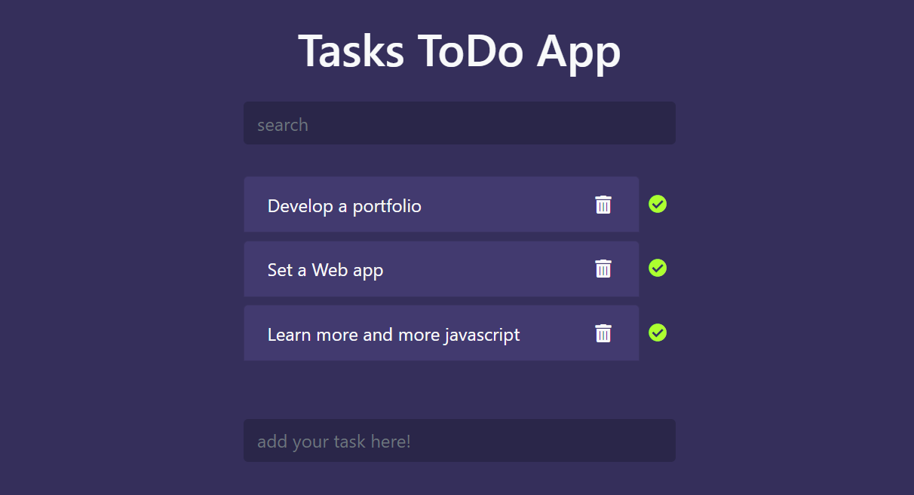
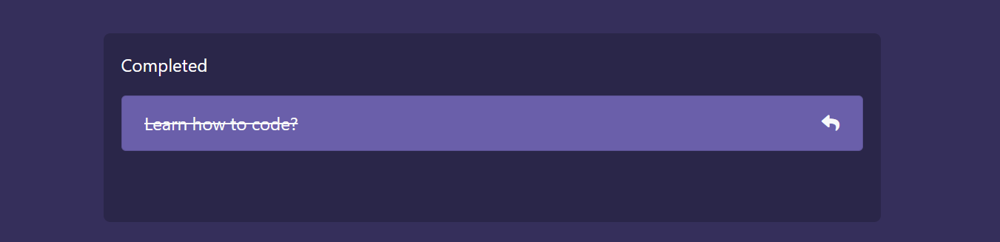
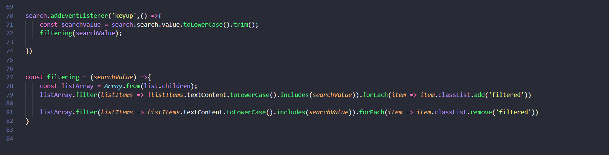

# ToDo-Tasks-app

## Help you to make a list of  your daily task to make you focus on your daily routines 
-------------------------------------------------
__First Section (adding,delete and search of Tasks)__

__Second Section (view of your complete Tasks list)__

#### Feel free to change or customize as much as you want

#### It sound awesome if you have a much better ideas to improve this

#### Do contribute and share your ideas with all other developers so that they can take advantage of your customization

Table of Content
================

* * * * *

-   [Sections](#)
-   [Getting started](#)
-   [How to get files](#)
-   [Change and Customization](#)
-   [How this app's code help you](#)
-   [Deployment](#)

Sections
========

* * * * *

1.  ADD,REMOVE,SEARCH   
2.  Completed Tasks

Getting Started
===============

* * * * *

These instructions will get you a copy of the project up and running on
your local machine for development and testing purposes

You will need [Git](#) and [Node.js](#)

How to get files
================

* * * * *

When you have done with installation!

Go to your required directory . and open GIT command line as shown below

Here you get a command line interface

put command to clone the files on your local computer

**\$ git clone https://github.com/fahadhassan1213/ToDo-Tasks-app.git** 

Change and Customization
========================

* * * * *

You can change the **app.js** file to addd more functionalities to the app

How this app's code helps you
========================
In the _app.js_ file you can get the javascript code 
Using the code you can be able to creat a list in which you can allow the user to ADD,REMOVE/DELETE,SEARCH the list items
You can also allow the user to recover the deleted items from the list

#### The following picture is divided into sections of code
Your task is to check the working of code and apply this code in you project and make your code more awesome

__Adding the Items to List__

__Delete and Recover Items__

__Search/Filter Items__

Deployment
========================
When you have done with the setup you should host your site online
You can use [NETLIFY](https://www.netlify.com/) for deployment of your
for hosting information about NETLIFY please read [hosting on Netlify](https://create-react-app.dev/docs/deployment/#netlify)

